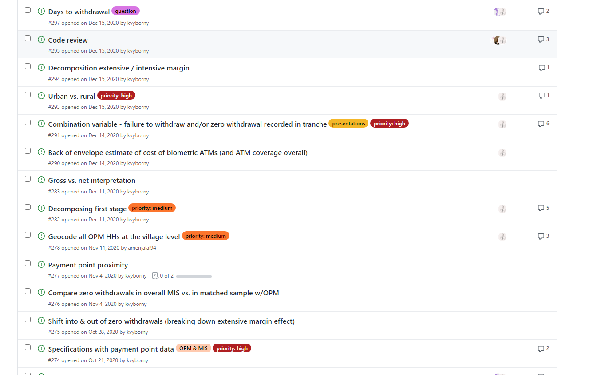

# Branch-PR-merge Cycle
Estas notas de clase están basadas en "GitHub - Pull Request training" , DIME Anelytics. The World Bank. 

  

# Setup Stage

## Open Issue

* **Issues** es una forma de documentar muchoo pero mucho mejor que los "emails" o reuniones personales(cuando alguien toma nota)

* **Issues** permiten a todos los miembros del equipo a proveer inputs y formas de solucion a los problemas que enfrentan.  

  

* Cómo creamos un Issue? 

    1. Click en la pestaña **Issue**
    2. Describe la tarea que van a hacer y asignar a la persona encargada. 
    3. Agreguen labels para busquedas futuras. 

## Create a branch

* Esto ya les he enseñado. Pero ahora me gustaría señalar que deberían crear el **branche** con un nombre asociado a la tarea que van a realizar. 

## Open a Pull Request (PR)
Puede parecer contraintuitivo pero deberían abrir un PR antes de que empiecen a trabajar todo. La mayoría de la gente primero termina todas las tareas y recién al final deciden hacer el pull request. 

La version que ustedes **Uniran** al master branch no será la que envías cuando creas el PR sino mas bien la que al final el Repo Mantainer haga **Merge** . 

Sugerencias :
1. Dar un nombre al PR un nombre asociado al nombre del branch, pero un poco más descriptivo. 
2. Pueden agregar un label _**Work in Progres**_. 
  

# Work Stage
1. El autor hace los **commits** como siempre.
2. El PR se actualizara con cada **commit** que ustedes realicen. 
3. Sigue agregando **commits** hasta que hayan terminado la tarea. 

  

4. Revisa los comentarios (_**Conversation Tab**_) que los otros autores han hecho acerca de tu trabajo (Repo Mantainer). 

  

5. Tienes que _tagear_ a otros colaboradores en caso quieras que ellos participen en la discusión.

  

6. Solo cuando hayan terminado de hacer todos los **commits** necesarios deberían solicitar o realziar el merge.

  

# Merge Stage 
1. Asegurate que el PR está correctamente documentado. IMAGÍNENSE QUE EN 2 AÑOS VIENE OTRA PERSONA A REVISAR EL CÓDIGO, ENTENDERÁ LA DISCUSIÓN? 
2. Si todo está Ok! entonces **merge** el PR.
3. Siempre, siempre elimina el Branche! 
4. Aún si quieres trabajar en una misma tarea en el futuro, elimina el branch y CREA DE NUEVO el branche. 
5. Finalmente , cerrar el Issue! 

Modificacion 1