<div style="text-align: center"> 

# How to install Python, R, and Julia in Jupyter Notebook?

</div>


- [Case 1: You have not installed Python before](#a-name"case1"a-case-1-you-have-not-installed-python-before)
  * [I. Installing Anaconda](#a-name"anaconda"ai-installing-anaconda)
  * [II. Installing R and R Studio](#a-name"rstudio"ai-installing-r-and-r-studio)
    + [A. Install Ikernel to run R in base (default) environment (not creating a new environment)](#a-name"ikernel"a-a-install-ikernel-to-run-r-in-base-default-environment)
  * [III. Installing Julia](#a-name"julia"aiii-installing-julia)
    + [A. What is Julia?](#a-name"juliaintro"a-a-what-is-julia)
    + [B. Running Julia in Jupyter Notebook](#a-name"juliajupyter"a-b-running-julia-in-jupyter-notebook)
- [Case 2: You have installed Python or Anaconda before](#a-name"case2"acase-2-you-have-installed-python-or-anaconda-before)
  * [I. You just have Python installed but no Anaconda](#a-name"pya"a-i-you-just-have-python-installed-but-no-anaconda)
  * [II. You have Anaconda installed](#a-name"justa"a-ii-you-have-anaconda-installed)


&nbsp; 
## <a name="case_1"></a> **Case 1: You have not installed Python before**
---
&nbsp; 

We will install Anaconda first and then set up  features to run R in Jupyter. 

&nbsp; 
### <a name="anaconda"></a>I. Installing Anaconda 

Follow these steps to install Anaconda correctly:
1. The first step is to download Anaconda from its [website](https://www.anaconda.com/products/individual#windows). 
2. Once downloaded, double click the installer to launch. Click Next and “I Agree”. After that, select an install for “Just Me” and click Next.
3. Then, the Anaconda installer will ask for a destination folder to install. We recommend you set it up in the default option provided. It's important to note that the directory path does not contain spaces or unicode characters.
4. The next is step is critical. In order to correctly install Anaconda for our purposes, choose **NOT** to add Anaconda to your PATH environment variable. It is also a [recommendation](https://docs.anaconda.com/anaconda/install/windows/) from Anaconda. About the second option, select "Register Anaconda3 as my default Python 3.7". 

5. Finally, click the Install button, and wait for a bit. After a successful installation, “Thanks for installing Anaconda” will pop up.
6. After installing, you will see a new program installed on your PC by typing "Anaconda" on Windows.


&nbsp; 

After installing Anaconda, we will configure the necessary options to be able to run R in a Jupyter Notebook. To do so, we have two options:

&nbsp; 

### <a name="rstudio"></a>I. Installing R and R Studio

To complete this process correctly, take into account that R Studio works under R. Then, it is important to **FIRST** install R and later R Studio.

* R 

To install R, we will need to follow the following steps:

1. Click [here](https://cran.r-project.org/), and select your operating system. To Windows users, follow this guide:

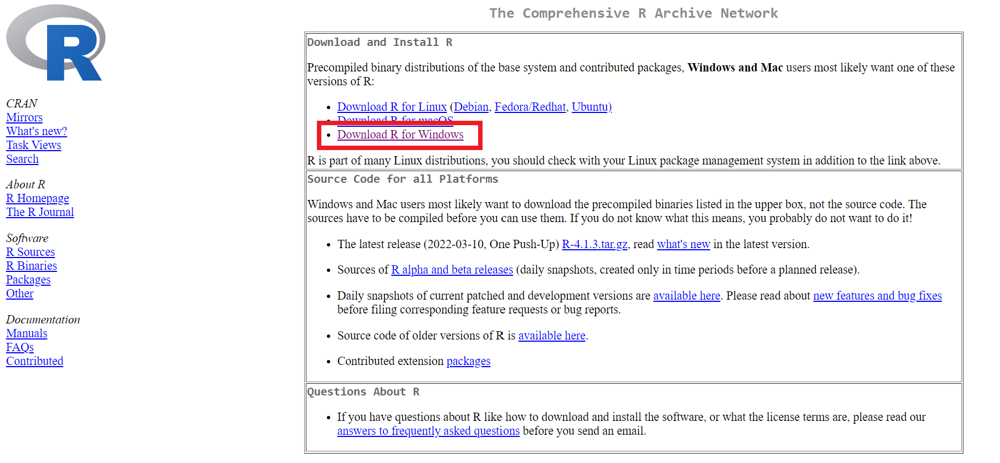

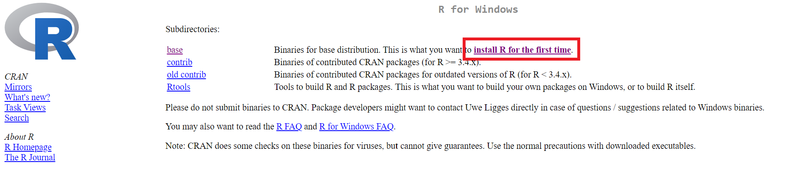

2. We are using the latest version of **R-4.1.3**.

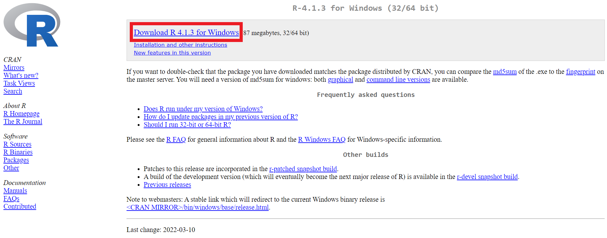

After that, all you need to do is to run the executable and R will be downloaded in your computer.

3. Follow this steps:

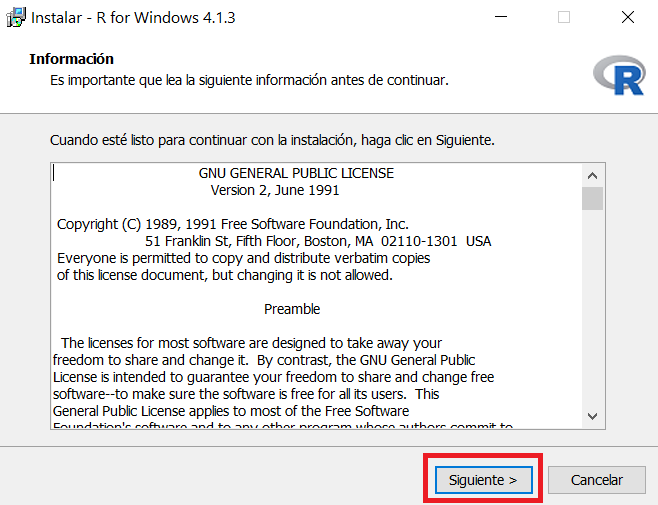

4. **It is important to remember the path where R is being downloaded.**


5. If you have a 64-bit operating system, then you don't need to select the 32-bit option.

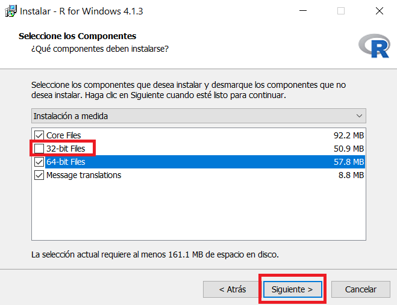

6. Continue with this process:

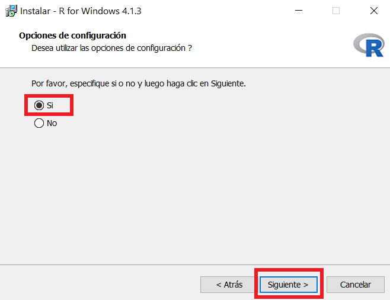

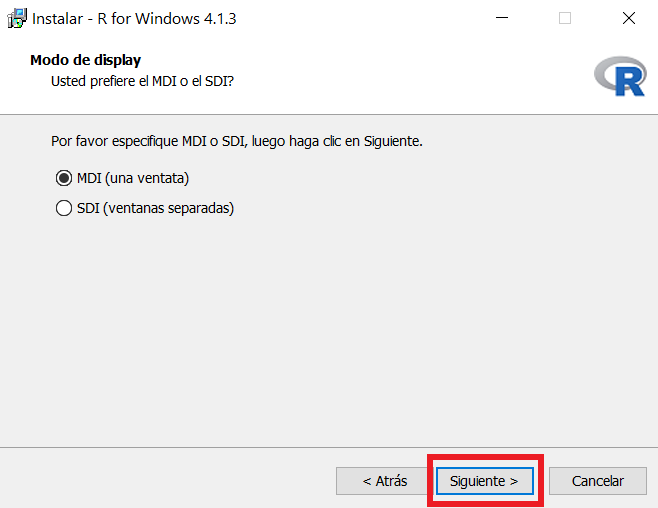

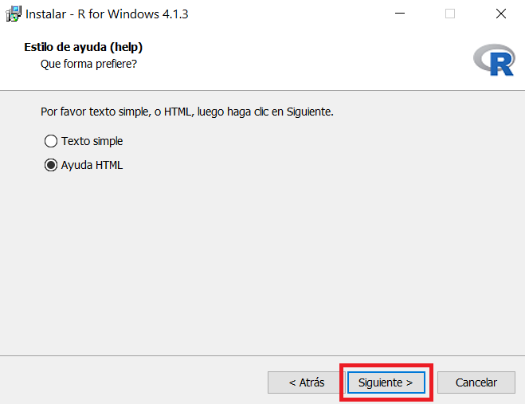

7. Final steps:

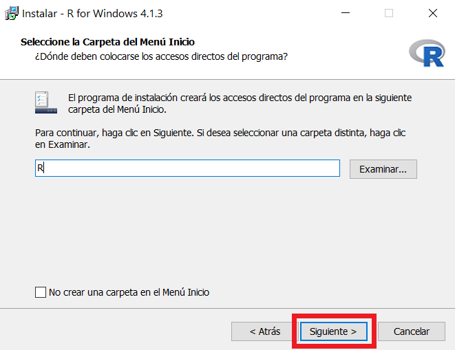

8. Finally, R will be corecctly downloaded in your computer.

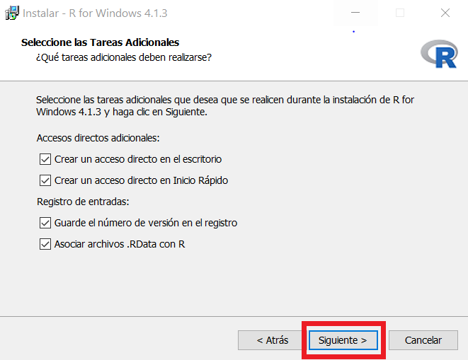


&nbsp; 

* R Studio

1. Click [here](https://www.rstudio.com/products/rstudio/download/) to go to the official web site of R Studio and to select the best option for you.

2. Windows users would select this executable:

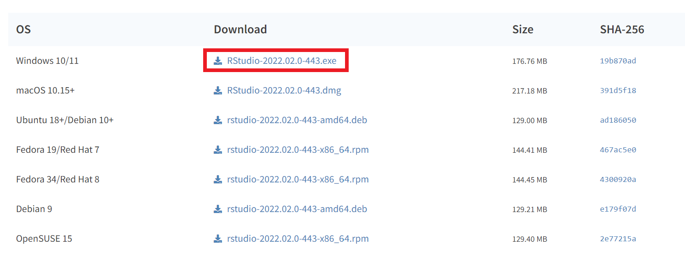

3. Run the executable and follow this guide:

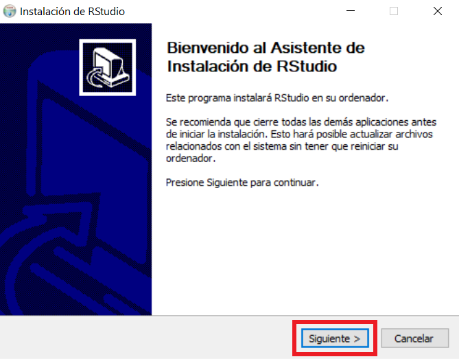

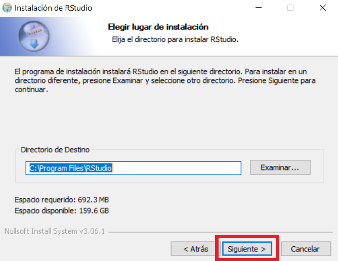

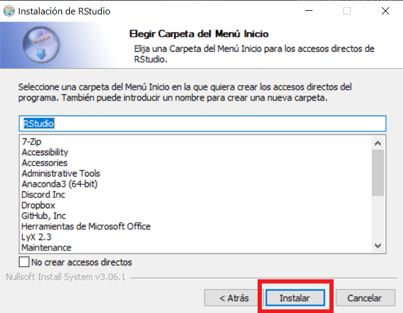

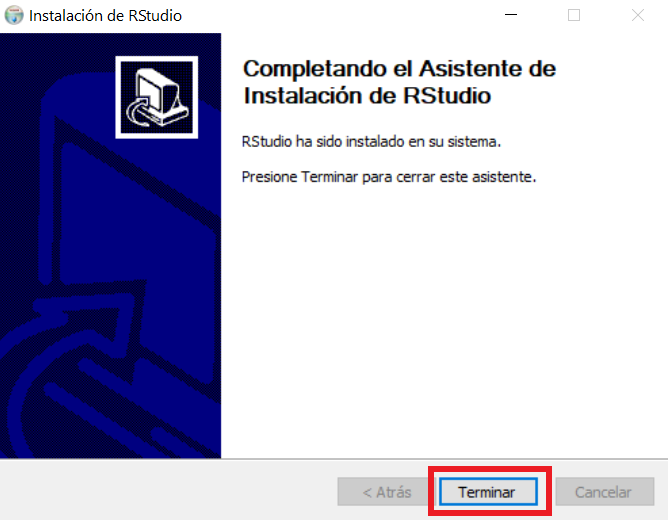


Congratulations! Now you can run both programs.


&nbsp; 

&nbsp; 

### <a name="ikernel"></a> A. Install Ikernel to run R in base (default) environment 

Now we are going to install some packages in R to make the kernel available to Jupyter Notebook. It can be accomplished by following these steps:

> **_IMPORTANT:_** This option requires R to have been previously installed.

1. Firstly you will need to start R terminal. To do so, search the folder where you install R previously. In this case, we have R in "C:\Program Files\R\R-4.1.1\bin". It will typically be there or in "Usuarios".


2. Open the Anaconda prompt. Then type <code>cd</code> (your directory) such as:
```
    cd C:\Program Files\R\R-4.1.1\bin 
```
It will set the directory to use R. So, type R to start.


3.  After that, we will install packages to use a function that makes the kernel available to Jupyter using [IRKernel](https://irkernel.github.io/installation/#windows-panel). 

4. Install the following packages by typing:
```ruby
install.packages(c('repr', 'IRdisplay', 'IRkernel'), type = 'source')
```
4. It will open a CRAN mirror. Choose "USA (OR) (https)". After installing, type the following to allow the kernel spec can be installed for the current user. 
```ruby
IRkernel::installspec()
```
5. Follow step 6 of [section I](#anaconda) to launch Jupyter Notebook.


&nbsp; 
### <a name="julia"></a>III. Installing Julia

&nbsp; 

### <a name="julia_intro"></a> A. What is Julia?

Julia is a high-level dynamic programming language. It is used by Machine Learning Researchers and Practitioners as it is developing a bunch of Machine Learning packages and Frameworks rapidly.

One programming language which is in competition with Python is Julia. As well as Python, Julia is also a high-level programming language, where we can write less amount of code as in Python. However, if we compare the speed of Python with Julia, here Julia takes the advantage. Julia is much faster than Python, and also solves its speed limitation.

In this course, we will be using the current long-term support (LTS) version of Julia, **1.6.5**. You can download Julia by clicking [here](https://julialang.org/downloads/). After clicking in the selected version, the download option will come up and based on your operating system choose the right option to download Julia. 

To Windows users, select the option in box.

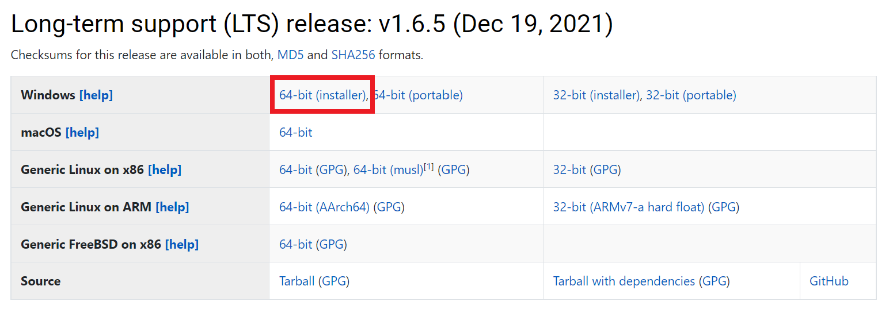


After running the executable, Julia will be installed on your system. Now we can access to Julia's terminal. In your search bar, type *Julia* and open the terminal. 

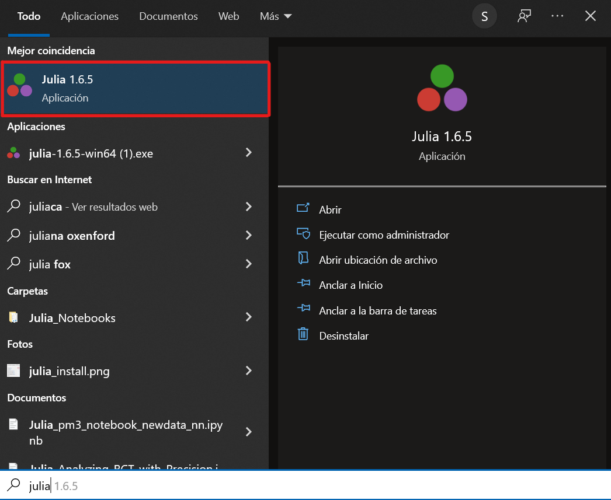


The screen below will appear after you open Julia.

 


&nbsp; 

### <a name="julia_jupyter"></a> B. Running Julia in Jupyter Notebook

On the Julia terminal, write 

    using Pkg

That's similar to the *import* statement in Python. 

Now type the following command:

    Pkg.add(“IJulia”)
    
The code above is adding the IJulia package to the Jupyter Notebook IDE, thae one we can access by using Anaconda Navigator. 


After executing those commands, wait for 3–4 minutes. It automatically will establish a connection between Julia and Jupyter Notebook, and now a new Jupyter Notebook can be created with Julia.

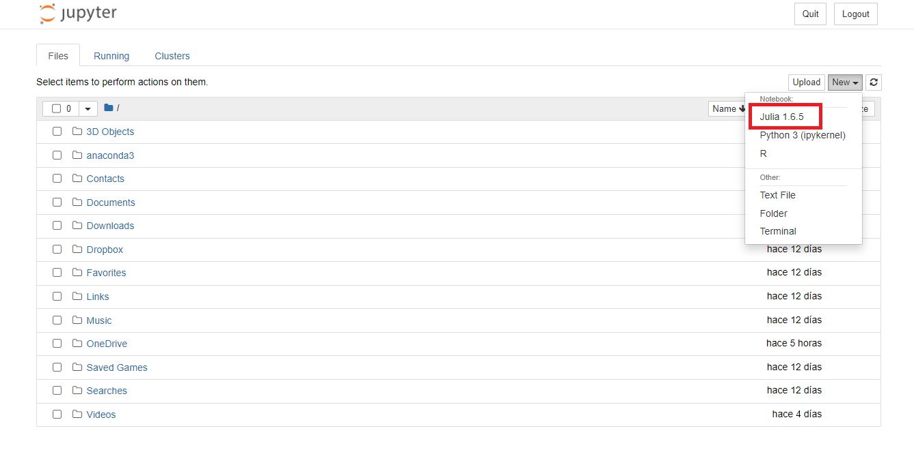


&nbsp; 
## <a name="case_2"></a>**Case 2: You have installed Python or Anaconda before**
---
&nbsp; 

Anaconda is an open-source distributor of Python and R. It aims to simplify package management and deployment. The packages are managed by conda system. It means it make your life easier when installing basic packages such as <code>numpy</code> or <code>pandas</code>. Therefore, it would be a lot easier to use Anaconda. 

&nbsp; 
> **_RECOMMENDATIONS:_** 
> 1. We highly recommend uninstalling Python completely. Even some folders left can cause problems with packages in the future. So make sure you have no folders named "Python" or "Anaconda".
> 2. To uninstall Python or Anaconda correctly, it should be done from the control panel.

&nbsp; 
### <a name="Py_A"></a> I. You just have Python installed but no Anaconda
If you have Python installed, we encourage you to change it to Anaconda, which also has a friendly navigator called "Anaconda Navigator" to check your packages and environments. To install Anaconda correctly, Python must be removed from your system completely. [Here](https://www.educative.io/edpresso/how-to-uninstall-python) we leave you a guide to do it. After uninstalling Python, follow the steps to install Anaconda as [section I](Python_R_installation.md#anaconda) explains.


&nbsp; 
### <a name="justA"></a> II. You have Anaconda installed

We encourage you to uninstall Anaconda completely in order to set configurations correctly. To do so, Make sure you uninstall Anaconda correctly by following these [steps](https://docs.anaconda.com/anaconda/install/uninstall/). Even folders left can cause problems with packages in the future. So make sure you have no folders named "Python" or "Anaconda".

If you prefer to keep Anaconda as you installed it in the past, **make sure you don't have Anaconda added to your <code>PATH</code> environment, because you could have problems creating a new environment.**

&nbsp; 
> **_RECOMMENDATIONS:_** 
> 1. Uninstall Anaconda completely in order to set configurations correctly. Even folders left can cause problems with packages in the future. So make sure you have no folders named "Python" or "Anaconda".
> 2. To uninstall Python or Anaconda correctly, it should be done from the control panel.
> 3. Make sure Anaconda **IS NOT** added to your <code>PATH</code> environment, because you could have problems creating a new environment.

