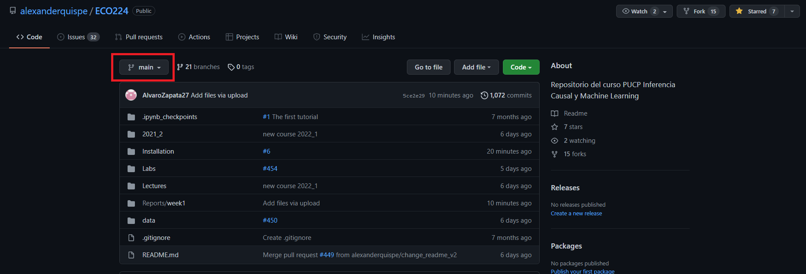
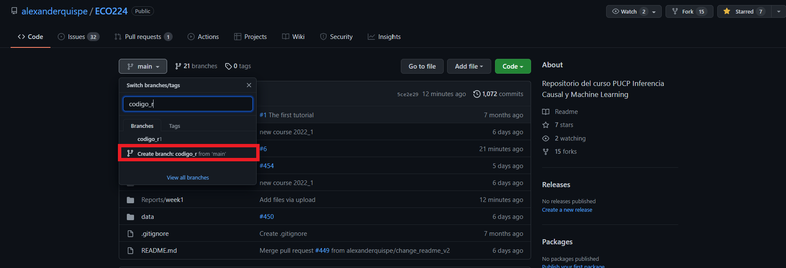
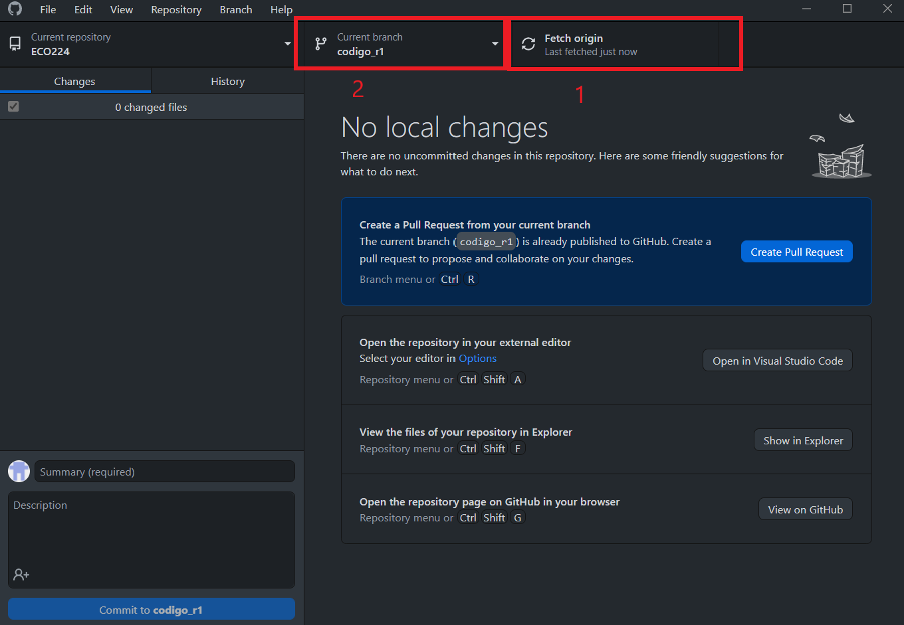
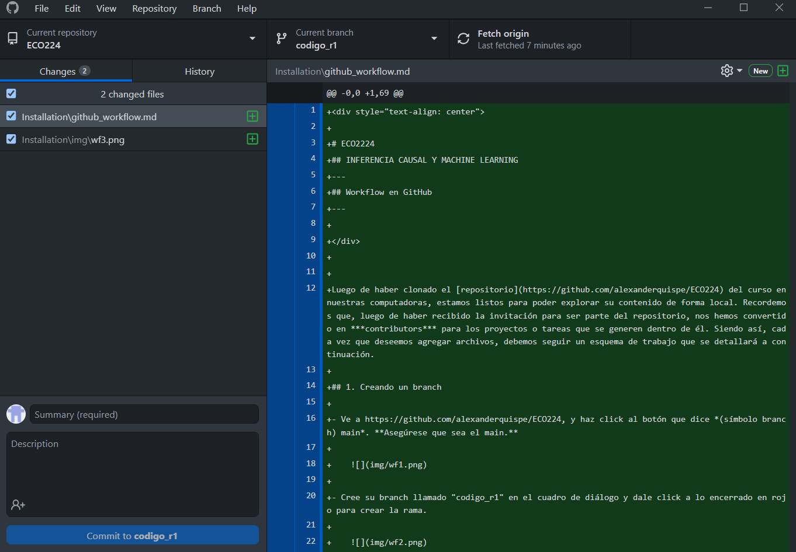

 

# ECO2224
## INFERENCIA CAUSAL Y MACHINE LEARNING 
---
## Workflow en GitHub
---

Luego de haber clonado el [repositorio](https://github.com/alexanderquispe/ECO224) del curso en nuestras computadoras, estamos listos para poder explorar su contenido de forma local. Recordemos que, luego de haber recibido la invitación para ser parte del repositorio, nos hemos convertido en ***contributors*** para los proyectos o tareas que se generen dentro de él. Siendo así, cada vez que deseemos agregar archivos, debemos seguir un esquema de trabajo que se detallará a continuación. 

## 1. Creando un branch

- Ve a https://github.com/alexanderquispe/ECO224, y haz click al botón que dice *(símbolo branch) main*. **Asegúrese que sea el main.**

     

- Cree su branch llamado "codigo_r1" en el cuadro de diálogo y dale click a lo encerrado en rojo para crear la rama. 

     

- Como último paso, ve a GitHub Destop y dale click en Fetch Origin para actualizar los cambios, y selecciona tu branch. Ahora empezaremos a hacer las modificaciones al reposotiorio.

     

- ¡Ahora ya puedes realizar modificaciones al repositorio de forma independiente!

## 2. Commits

Cuando agreguemos o editemos archivos en nuestra carpeta clonada, nuestro Github Desktop Mostrará la siguiente ventana:

Github desktop se ha dado cuenta que hay nuevos cambios. Todo aquello resaltado en verde debe entenderse como "entradas" al documento. Por otro lado, si hubiera entradas resaltadas en rojo, estas se reconocen como "salidas" o cualquier "delete" realizado a las líneas de código. 

> Nota: Cualquier modificación que se haga dentro de la carpeta clonada tendrá un sync inmediato en el GitHub Desktop. 

Luego de haber agregado archivos a nuestra carpeta, vamos a generar un commit siguiendo estos pasos: 

Para que estos nuevos archivos, subido a la carpeta clonada, se vean en el repositorio del curso (*para que suba a la nube del repo*, debemos añadir un pequeño comentario sobre **Summary (required)**. 

 
 
Esto hará que el botón azul **Commit to main** se active, y se pueda hacer el merge con el main branch del repositorio. 

 

## 3. Pull request

 Selecciones *Push Origin*  

         

    * Seleccione *Create Pull request*. Esta acción lo dirigirá a una ventana en el navegador.

         

    * Haga click nuevamente en *Create Pull request*.

         

    * Haga click en *Merge Pull Request*.

        
            
    * Luego, haga click en *Confirm Pull Request*

         

    * **IMPORTANTE:** Finalmente, elimine su branch dando click en *Delete branch*.
        
         
  

 

### Aprender Github desde el command line: 

- En este tutorial, hemos lo visto los elementos esenciales para utilizar Github,; sin embargo, hay una forma de usar Github desde la consola. Aquí hay una lista de referencias en caso desee explorar más sobre este uso: https://education.github.com/git-cheat-sheet-education.pdf

