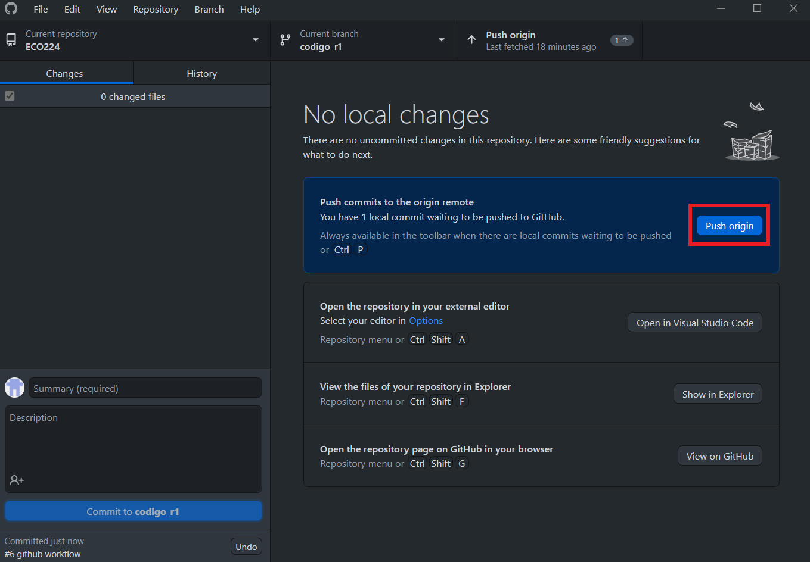
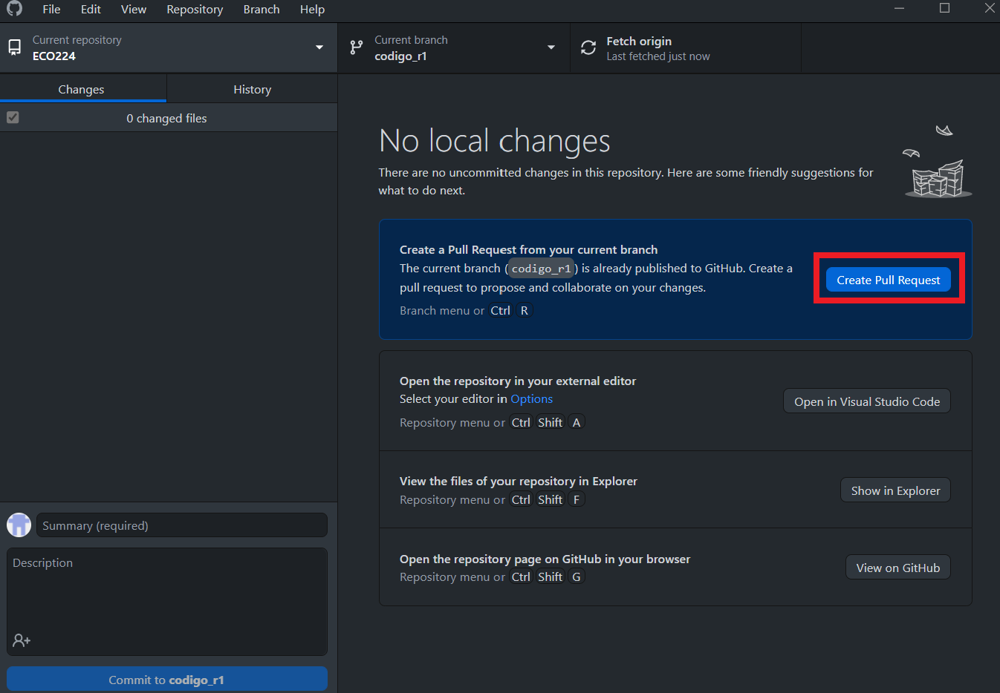
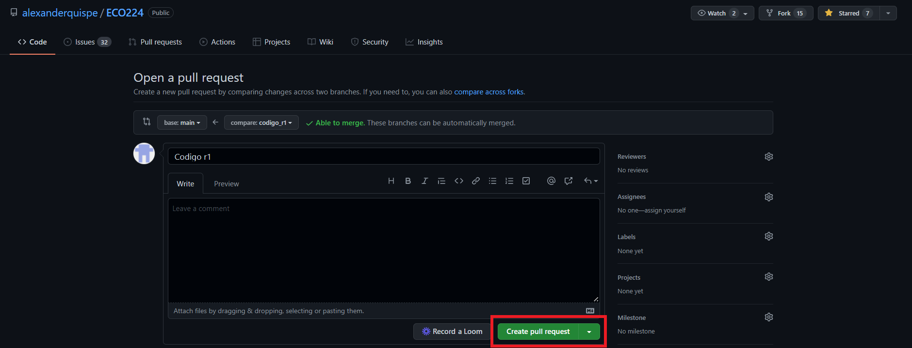
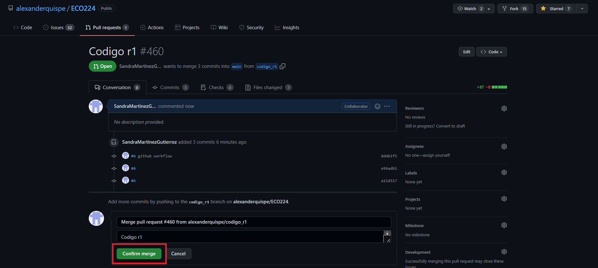
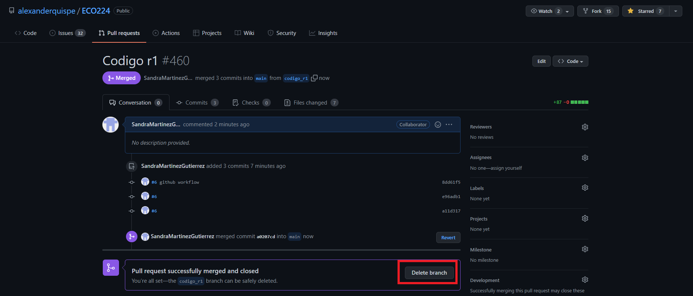

 

# ECO2224
## INFERENCIA CAUSAL Y MACHINE LEARNING 
---
## Workflow using Github
---

Once we have cloned our [repository](https://github.com/alexanderquispe/ECO224) on our computers, we are now ready to explore its content locally. Notice that when we accepted the invitation to collaborate, we became ***contributors*** to any project or assignment within it. Therefore, every time we want to add some files, we should follow the workflow detailed below.

 

## 1. Creating a branch

- Go to https://github.com/alexanderquispe/ECO224, and click on the button * *(branch symbol) main* * . **Make sure you are in the main**.

    

- Create your branch "codigo_r1" and click on the box.  

    

- As a final step, go to GitHub Desktop and click on Fetch Origin to update the changes, then select your branch. Now we can start to make the modifications to the repository from our computers.

     

 

## 2. Commits

When we add or edit files in our cloned folder, our Github Desktop will display the following window:

Github Desktop has noticed that there are new changes. For example, everything highlighted in green should be understood as "inputs". On the other hand, if there were entries highlighted in red, these are recognized as "deletes" made to the code lines. 

> Note: Any modification made within the cloned folder will have an immediate sync in GitHub Desktop.

After having added files to our folder, we will generate a commit by following these steps:

If we want to see these new files in the repository (to be uploaded into the repository cloud), we must add a small comment in **Summary (required)**. 

 
 
This will activate the blue button **Commit to branch**, and then we will be able to the merge our edits to our branch.

 

 

## 3. Pull request

When your edits are ready to be merged, you can make a pull request to integrate your edits into the main branch.

1. Select *Push Origin*  

     

2. Select *Create Pull request*. This will open a window in the browser.

     

3. Make sure that the main branch is selected as *base: main*, and that your branch is in *compare: codigo_r1*. Now, click on *Create Pull request*.

     

4. Click on *Merge Pull Request*.

     
            
5. Then, click on *Confirm merge*.

     

6. **IMPORTANT:** Finally, delete your branch by clicking on *Delete branch*.
        
     
  
