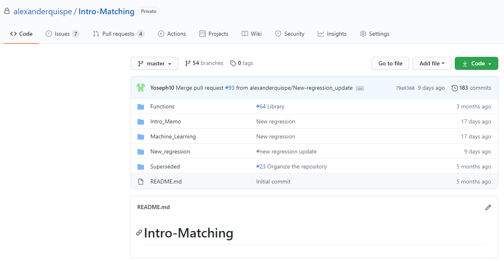
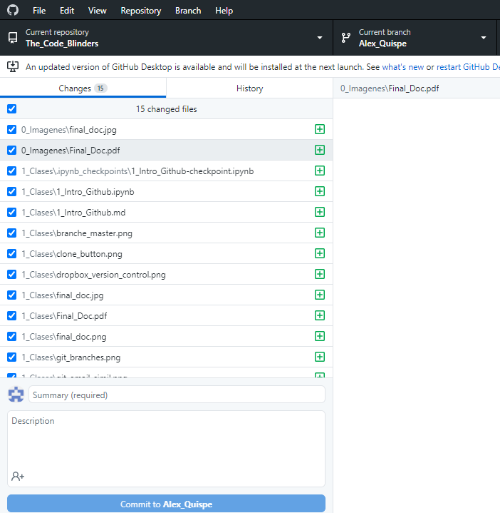

# The Code Blinders 
## Introducción a Git & Github - Febrero 3,  2021
Gran parte de este material está basado en las notas de DIME Analytics - World Bank. 

## Antes de empezar esta sesión:
1. ¿Tiene una cuenta de GitHub.com? Si no, ir a https://github.com/join y regístrate
2. ¿Ha enviado su nombre de usuario de GitHub al organizador the.code.blinders@gmail.com? ---> Pendiente
3. ¿Ha instalado GitHub Desktop? Si no, ir a https://desktop.github.com/ y descárguelo.
4. ¿Ha iniciado sesión al menos una vez en GitHub Desktop? Si no abrir GitHub Deskptop e inicie sesión con su cuenta de GitHub.
5. ¿Ha sido invitado al repositorio https://github.com/antonioalt23/The_Code_Blinders? Y has aceptado la invitacion? ---> Pendiente

## Para qué es útil GIT?
<!--  -->

 
 

1. Git resuelve el problema de "Final.doc". Se acuerdan de ese archivo que 
ustedes suelen llamar _**"ESTA SERÁ MI ÚLTIMA VERSIÓN FINAL FINALÍSIMA?**_ 

2. Hay muchas formas de atacar este problema.
Ustedes podrían llamar sus archivos de la siguiente manera : **_Fecha_Tesis_Iniciales.doc_**. Por ejemplo 

* 03feb21_Tesis_Alex
* 14feb21_Tesis_AnzonyRev

3. Git puede trackear la _Fecha_ y las _Iniciales_ cada vez que alguna persona modifique el archivo.

4. Esto es muy pero muy util si hay más de 2 personas trabajando en el mismo archivo. 
    * Para los usuarios de Dropbox, se les hace familiar el **"Copy Conflict"** problema? 
    * **"Ya no puedo reproducir la primera versión de mi reporte o código."**
    * **"Quién habrá escrito esto hace más de 2 años y para qué?"**

## Qué es Git, Github y Github Desktop?

 
 

Hay tres conceptos básicos que deben aprender:

* **Clone**
* **Commit**
* **Branch**

## Cómo navegar en GitHub.com?
Tu Project Folder es llamado **repositorio**  en Git. Vamos a llamar a la **main page** a https://github.com/antonioalt23/The_Code_Blinders. 

### REPO

### MAIN PAGE 

## **Clone **
Clonar es básicamente descargar un repositorio a tu computadora. 
La diferencia entre clonar y descargar es que **cuando Git clona un repositorio, recuerda de dónde tu lo has descargado.** Nosotros necesitamos esto, porque cuando querramos hacer algún cambio, **Git recuerda a donde direccionar el cambio.** 

### Cómo clonar un Repositorio? 
1. Ir al **main page** de https://github.com/antonioalt23/The_Code_Blinders.
2. Click en el botón verde _Clone or download button_

3. Click **Open in Desktop**
4. Deberías seleccionar dónde clonar el repositorio. Usualmente se guarda en la carpeta _Mis Documentos_ . **JAMÁS GUARDARLO EN UNA CARPETA COMPARTIDA COMO DROPBOX O GOOGLE DRIVE**

### **Explora lo que clonaste**!!!
Como sugerencia deberían revisar los archivos y folders que clonaron en su computadora con los archivos que aparecen en el repositorio  github.com/antonioalt23/The_Code_Blinders.

### Qué es VERSION CONTROL (HISTORIAL DE VERSIONES)? 
Vamos a ver un ejemplo de cómo funciona **Version Control** en un software familiar para ustedes: DROPBOX.  [Ejemplo](https://www.dropbox.com/history/Geocode_WB/2_Geocoded_Data/pp_list_2015_2019_part1_final_Attia.xlsx?_subject_uid=392562030&undelete=1)

En Dropbox cada vez que guardas el archivo se guarda en el historial de versiones. **Pero cada vez que ustedes guardan el archivo en verdad hicieron cambios significativos?** tuvo alguna razón de por qué guardaron el mismo archivo dos veces en un mismo día? 

## **Qué es un Commit?**
En Git nosotros **usamos commits para indicar cada modficacion significativa que hicimos entre dos versiones de nuestro project folder.**  

Piensen en un **commit = snap shot** de todos los archivos en el Project Folder, y enumera cómo cada **snap shot** difiere entre previas versiones (Commit previo).

Cada Commit:
* **Tiene una Fecha de edición**
* **Trackea quién hizo el commit o cambio significativo**

Antes de hacer un **commit** necesitamos primero aprender qué son los **branches**. 
Pero vamos a practicar un poco! ------> Vamos a crear un nuevo archivo y lo guardaremos en la carpeta _1_Clases_.

### Cómo explorar los **commits**
Cuando hacemos un commit podemos explorar cómo el repositorio https://github.com/antonioalt23/The_Code_Blinders fue creado y se ha ido modificando en el tiempo. 
Podemos ver la lista de **commits** similar a lo de DropBox, pero se supone que en **Git solo guardamos cambios significativos.** 

* github.com/antonioalt23/The_Code_Blinders/commits

## **Qué es un Branch?**
El uso de **Branches es la herramienta "Killer" de Git**. Esta caracteristica de Git es lo que lo vuelve tan potente como herramienta de colaboración y version control. 

 
 

Cuando creas un **Branche** esto te permite **crear una copia de el codigo donde puedes trabajar o experimentar**, si te gusta el resultado, **usteden pueden unir su experimento con la version principal del código.**

### Otra forma de explorar el repositorio

github.com/antonioalt23/The_Code_Blinders/commits ----> Linear Progression

github.com/alexanderquispe/Intro-Matching/network ----> Non-linear Progression

### Explorando branches
* Pueden cambiar de branch en /commits. Qué pasa cuando cambian de branch?
* Si van al **main page**, qué pasa si cambian el branche ahi? 
* Cuál es la versión que está clonada en tu computadora? En realidad todas estan clonadas, pero solo una es **mostrada** , aquel branch en el que trabajas. 
* Qué pasa con el contenido del folder en tu computadora cuando checas otro branch en Github Desktop? 

### **Crear un branche**:
1. ir a https://github.com/antonioalt23/The_Code_Blinders y 
click en el botón donde dice **_main_**. 

2. Escribe tu nombre en ese campo y click en _Create branche_ : _tu_nombre_ . Asegúrense que diga **"from master"**

3. Ahora debería aparecer otro Branch con _tu_nombre_

4. Ir a https://github.com/antonioalt23/The_Code_Blinders/network  para ver que tu branch ha sido incluído ahí. 

### Combinar Commit & Branch
### Ahora es tiempo de colaborar.
1. Asegurense que su **branch** aparece en GitHub Desktop
2. Abrir un editor de texto. Notepad si usas windows o TexEdit si alguno usa Mac. 
3. Googleen su canción favorita y copien las letras en el editor de texto.
4. Guarden el archivo de acuerdo a las siguientes instrucciones
* Guardar en formato .txt. 
* Nombren el archivo : tunombre_nombrecancion

### **Por fin!!! Nuestro Primer **Commit****
1. Abrir la pestaña de cambios en GitHub Desktop

2. GitHub Dektop trackea tu repositorio clonado y nota que has realizado algunos cambios. 
3. Necesitas realizar estos pasos requeridos para **commit** tu nuevo archivo al repositorio. 

* Asegúrate que el archivo que has creado o modificado aparezca (Guarda tus cambios)
* Escribir un **commit message** y click commit to master.
* Clickear en botón **sync**

### Checkear tu **Commit**
1. Ir a https://github.com/antonioalt23/The_Code_Blinders/network
    * Puedes ver tu **commit**

2. Ir a https://github.com/antonioalt23/The_Code_Blinders/commits
    * Puedes encontrar tu **commit**?

## **Pull Request**
Cuando terminas de editar el codigo que has clonado y ya estás listo **POR FIN** para poder unir esos cambios al **main version** del código, tu haces un **PULL REQUESST**. 

**PULL REQUESST** = Solicitar que tus modificaciones se transfieran al **master branch.**

Usualmente siempre existe una persona que es llamado el **REPO MAINTAINER**, quien tiene acceso al **master branch**. Por lo tanto, la única manera de contribuir al **master branche**  es atraves de un **_pull request_**. 

### Cómo hacer un Pull Request

1. Ir a https://github.com/antonioalt23/The_Code_Blinders/pulls 
2. Click en _New Pull Request_
3. Selecciona tu branch
4. Revisa si las modificaciones que estas solicitando para el master branche. 
**Es importante este paso porque en caso de algun conflicto no podrán unir sus cambios.** Si todo esta ok entonces click en **Create Pull Request**.
5. Finalmente click en _Create pull request_ de nuevo. 

## Puedes ver tu canción favorita en el master branch ahora? por qué? por qué no? 
