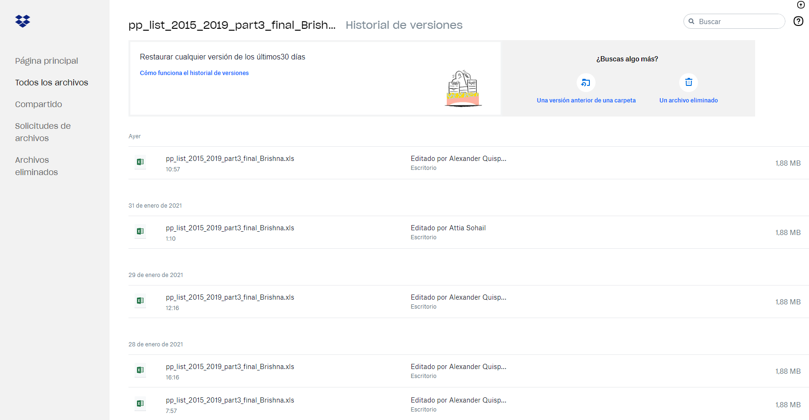
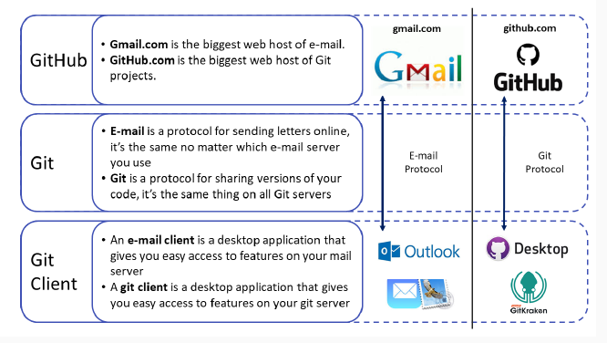
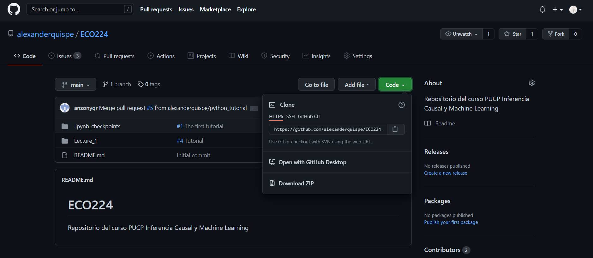
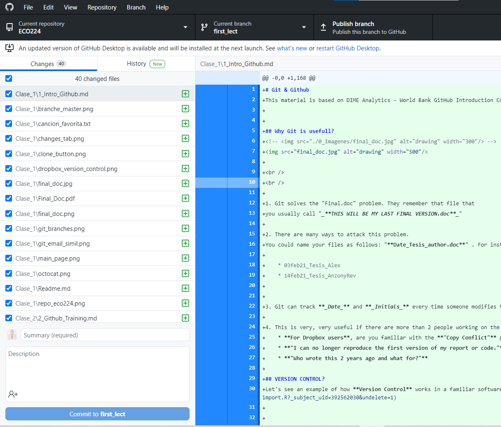
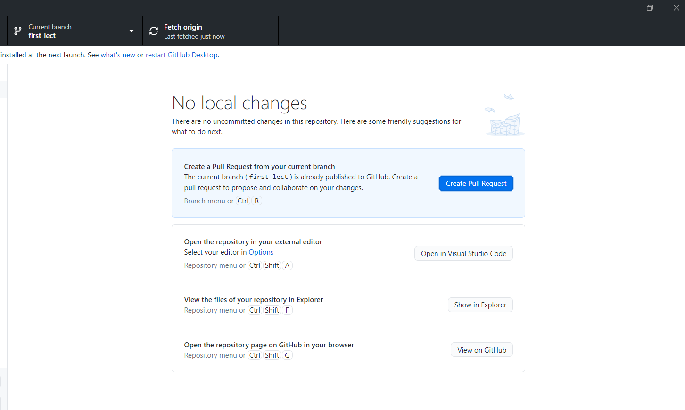

# Git & Github
This material is based on DIME Analytics - World Bank GitHub Introduction Course [Visit this webpage](https://happygitwithr.com/big-picture.html#what-is-the-payoff).

## Why Git is usefull? 
<!--  -->

 
 

1. Git solves the "Final.doc" problem. Remember that file that you usually call "_**THIS WILL BE MY LAST FINAL VERSION.doc**_"?

2. There are many ways to attack this problem.
You could name your files as follows: "**Date_Thesis_author.doc**" . For instance

    * 03feb21_Thesis_Alex
    * 14feb21_Thesis_AnzonyRev

3. Git can track **_Date_** and **_Initials_** every time someone modifies the file.

4. This is very, very useful if there are more than 2 people working on the same file.
    * **For Dropbox users**, are you familiar with the **"Copy Conflict"** problem?
    * **"I can no longer reproduce the first version of my report or code."**
    * **"Who wrote this 2 years ago and what for?"**

## Version Control Systems
Let's see an example of how **Version Control** works in a familiar software for you: DROPBOX.  [Example](https://www.dropbox.com/history/202108_Bolivia/03_Scripts/01_import.R?_subject_uid=392562030&undelete=1)

In Dropbox every time you save the file it is saved in the version history. 
* **But every time you save the file did you actually make significant changes?** 
* **Did you have any reason why you saved the same file twice in the same day?**

## What is Git, Github y Github Desktop?

 
 

## Clone, Branch, Commit and Pull Request

### CLONE
Clone is basically downloading a repository(_the last version_) to your computer.
The difference between cloning and downloading is that **when Git clones a repository, it remembers where you downloaded it from.** We need this, because when we want to make a change, **Git remembers where to direct the change.**

#### How to clone a Repository? 
1. Go to **main page** de https://github.com/alexanderquispe/ECO224
2. Click on green buttom **Code**
3. Click **Open with GitHub Desktop**
4. You should select where to clone the repository. It is usually saved in the _My Documents_ folder. **NEVER SAVE IT IN A SHARED FOLDER LIKE DROPBOX OR GOOGLE DRIVE**

### BRANCH
Using **Branches is Git's "Killer" tool**. This feature of Git is what makes it so powerful as a collaboration and version control tool. 

 
 

When you create a **Branche** this allows you **to create a copy of the code where you can work or experiment**, if you like the result, **you can link your experiment with the main version of the code(MASTER BRANCH).**

#### Exploring Branches
* They can switch branches in / commits. What happens when they change branches?
* If they go to the **main page**, what happens if they change the branche there?
* What is the version that is cloned on your computer? Actually all are cloned, but only one is **shown**, that branch you work on.
* What happens to the contents of the folder on your computer when you check another branch in Github Desktop?

#### **Create a branche**:
1. Go to a https://github.com/alexanderquispe/ECO224
click on the buttom **_main_**. 

2. Write your task name and click on _Create branche_ : _task_name_ . Make sure you clone **"from master"**

3. Now your branch should appear as _task_name_

4. Go to https://github.com/alexanderquispe/ECO224/network to see if your branche has been created.

### COMMIT

In Git we **use commits to indicate every significant modification we made between two versions of our project folder.**

Think of a **commit = snap shot** of all files in the Project Folder, and list how each **snap shot** differs between previous versions (Previous Commit).

#### Each Commit:
* **Has an Edition Date**
* **Track who made the commit or significant change**

#### Explore the **commits**
When we commit we can explore how the repository was created and has been modified over time.
We can see the list of **commits** similar to DropBox, but it is assumed that in **Git we only save significant changes.**
https://github.com/alexanderquispe/ECO224/commits

### PULL REQUEST
When you finish making your changes and you are ready **FINALLY** to **merge** those changes to the **main version** of the code, you do a **PULL REQUESST**.

**PULL REQUESST** = Request that your modifications be transferred to the  **master branch.**

Usually there is always a person who is called the **REPO MAINTAINER**, who has access to the **master branch**. Therefore, the only way to contribute to the **master branche** is through a **_pull request_**.

#### How to do a Pull Request

1. Go to https://github.com/alexanderquispe/ECO224/pull
2. Click on _New Pull Request_
3. Select your branch
4. Check if the modifications you are requesting for the master branche.
**This step is important because in case of any conflict you will not be able to unite your changes.** If everything is ok then click **Create Pull Request**.
5. Finally click on **_Create pull request_** again.