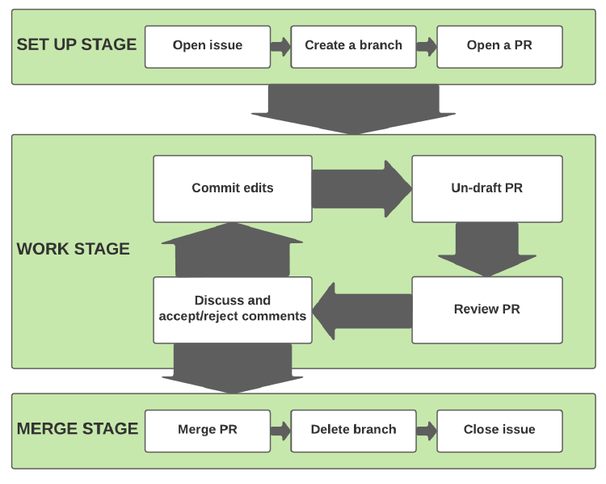
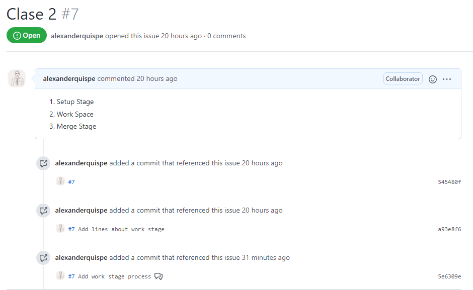
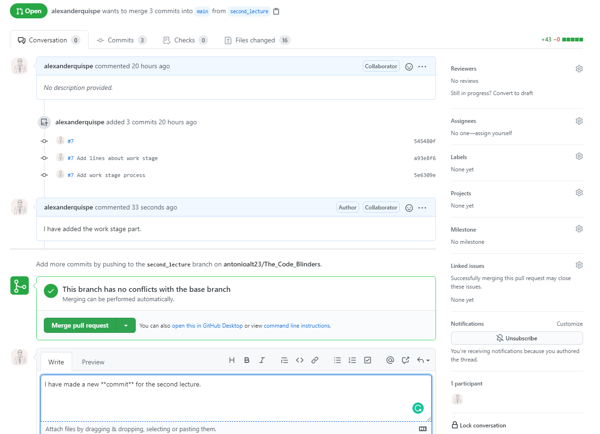

# Branch-PR-merge Cycle
This material is based on DIME Analytics - World Bank GitHub Introduction Course [Visit this webpage](https://mfr.osf.io/render?url=https://osf.io/8h6eb/?direct%26mode=render%26action=download%26mode=render).
  

## 1. Setup Stage

### a) Open Issue

* **Issues** is a way of documenting much better than "emails" or personal meetings (when someone takes notes)

* **Issues** allow all team members to provide input and ways of solving the problems the team faces.

  

* How do we create an Issue?

     1. Click on the **Issue** tab
     2. Describe the task they are going to do and assign to the person in charge.
     3. Add labels for future searches.

### b) Create a branch

* This I have already taught you. But now I would like to point out that you should create the **branche** with a **name associated with the task** that you are going to perform.

### c) Open a Pull Request (PR)
It may seem counterintuitive but you should open a PR before you all start working. Most people finish all the tasks first and only decide to do the pull request at the end.

The version that you will **Join** to the **master branch** will not be the one you send when you create the PR, but rather the one that the Mantainer Repo does **Merge** at the end.

Suggestions :
1. Give a name to the PR a name associated with the name of the branch, but a little more descriptive.
2. They can add a label _**Work in Progres**_.
  

## 2. Work Stage
### a) Commit edits
The author does the **commits** as usual. The PR will be updated with each **commit** that you make. Keep adding **commits** until the task is done.

  

### b) Review Pull Request
Review the comments (_**Conversation Tab**_) that other authors have made about your work (Repo Mantainer). You have to _tag_ other contributors in case you want them to participate in the discussion.

  

  

### c) Discuss and accept/reject comments
The team needs to decide if comments on the changes are accepted or rejected. Only when you have finished making all the necessary **commits**, including comments from colaborators should you request or perform the merge.

  

## 3. Merge Stage 
### a) Make sure the PR is properly documented. 
IMAGINE THAT IN 2 YEARS ANOTHER PERSON COMES TO REVIEW THE CODE, WILL YOU UNDERSTAND THE DISCUSSION?

### b) If everything is Ok! then **merge** the PR.

### c) Always **remove/delete the Branch** once you are done the specific task! Even if you want to work on the same task in the future, delete the branch and CREATE the branche AGAIN.

### e) Finally, **close the Issue**!
